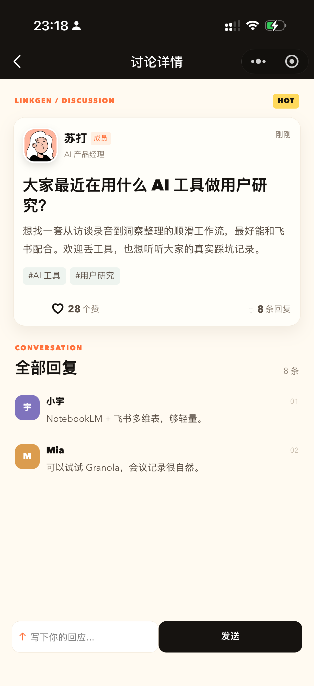

# LinkGen AI 社群小程序

面向 AI 从业者、独立开发者和创作者的微信小程序社区。当前版本使用本地数据，打开即可体验完整交互。

## 已实现

| 模块 | 交互 |
| --- | --- |
| 发现 | 帖子流、标签筛选、关键词搜索、点赞、评论、发帖 |
| 活动 | 线上/线下筛选、活动详情、报名、链接导入草稿、Agent 候选审核 |
| 运营 | 待审核队列、通过/驳回、官方直接发布活动 |
| 通讯录 | 成员搜索、标签筛选、成员名片、交换微信申请提示 |
| 我的 | 个人数据名片、社群统计、编辑昵称/身份/简介/目的/标签 |

## 运行

1. 用微信开发者工具导入项目目录。
2. 确认 `project.config.json` 中的 AppID。
3. 编译运行，默认进入“发现”页。

数据写入本地 Storage，相关 key 与默认数据位于 `utils/linkgen-data.js`。这样可以先验证产品流程；接入云开发时，将该文件的读写函数替换为云函数调用即可，页面层不需要重写。

活动链接导入与 Agent 采集的生产接口边界见 `docs/linkgen-ingest-architecture.md`。当前页面中的链接解析和 Agent 搜索使用本地演示数据，真实公众号/小红书解析需要接入服务端。

## 页面结构

```text
pages/feed              发现 / 帖子流
pages/events            活动日历
pages/contacts          通讯录
pages/profile           我的 / 数据名片
pages/post-detail       帖子详情与评论
pages/event-detail      活动详情与报名
pages/member-detail     成员名片
pages/create-post       发起讨论
pages/create-event      提交活动
pages/edit-profile      编辑个人名片
pages/admin-review      活动审核与官方发布
```

## 接入云端时的状态建议

`活动草稿 --(用户提交)--> 待审核 --(官方通过)--> 已发布 --(活动结束)--> 已结束`

`帖子草稿 --(发布)--> 已发布 --(举报/审核)--> 隐藏`

当前页面已保留 `official`、`status`、`joined` 等字段，可直接映射数据库 schema。

公开运营主体与备案判断见 `docs/linkgen-compliance-research.md`。

## 小程序截图

以下截图来自 LinkGen 小程序当前设计稿，展示发现、帖子详情、活动日历、通讯录、成员名片和个人名片流程。

<table>
  <tr>
    <td></td>
    <td></td>
    <td></td>
  </tr>
  <tr>
    <td align="center">发现首页</td>
    <td align="center">帖子详情</td>
    <td align="center">活动日历</td>
  </tr>
  <tr>
    <td></td>
    <td></td>
    <td></td>
  </tr>
  <tr>
    <td align="center">通讯录</td>
    <td align="center">成员名片</td>
    <td align="center">我的</td>
  </tr>
  <tr>
    <td></td>
  </tr>
  <tr>
    <td align="center">编辑名片</td>
  </tr>
</table>

## 相关文档

- [功能说明与页面截图](docs/linkgen-feature-overview.md)
- [活动链接导入与 Agent 采集架构](docs/linkgen-ingest-architecture.md)
