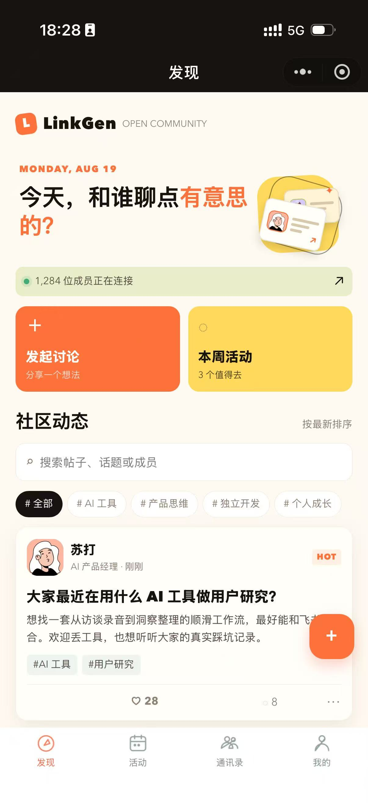
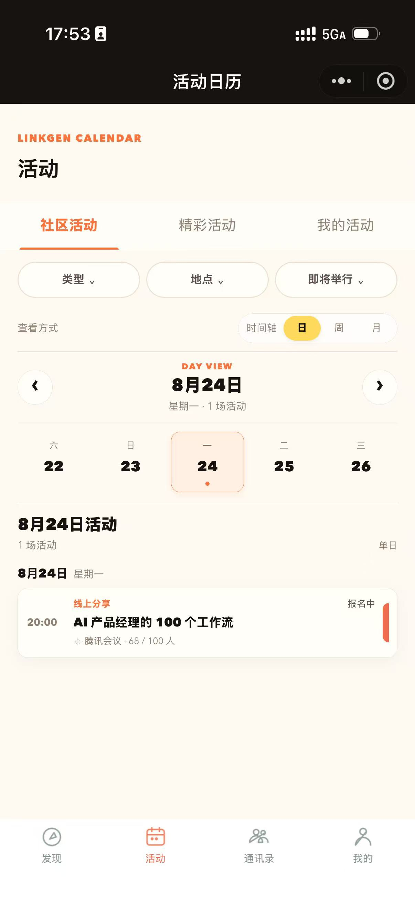
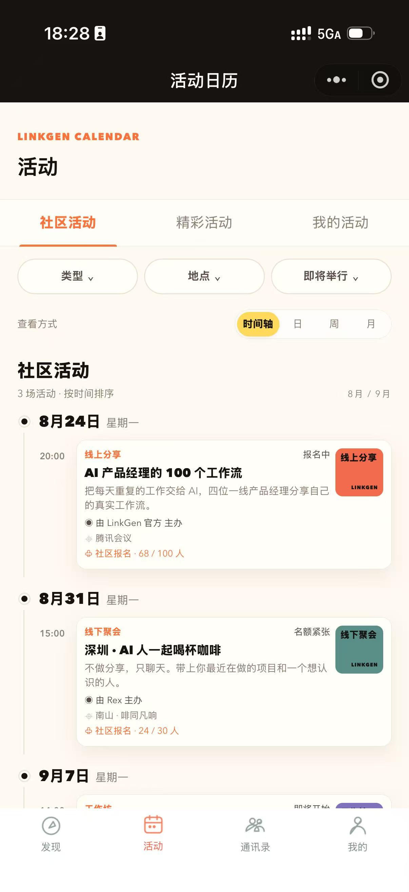
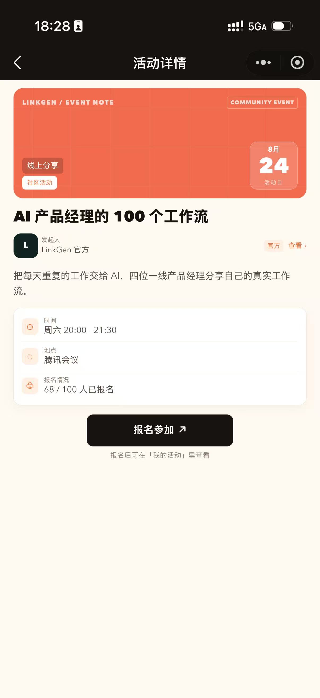
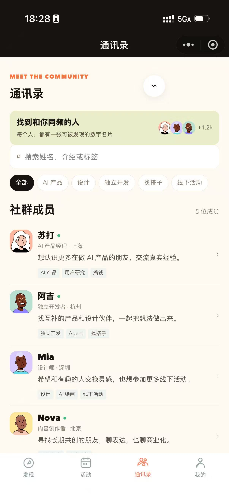
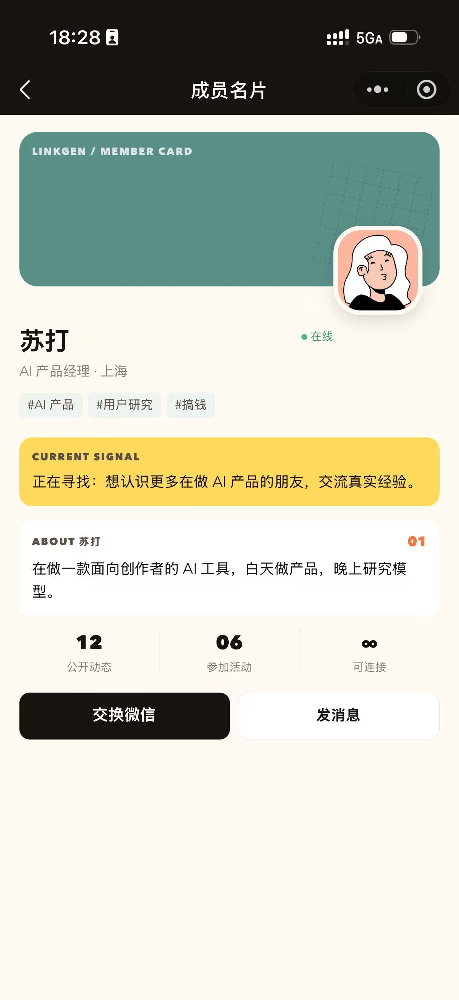
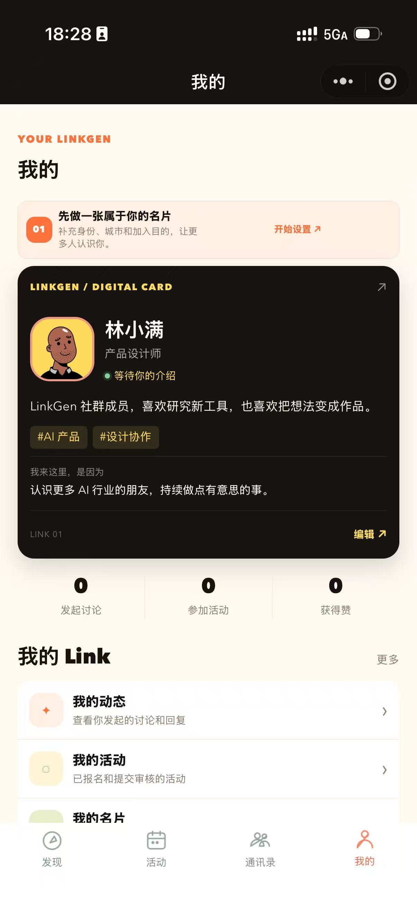
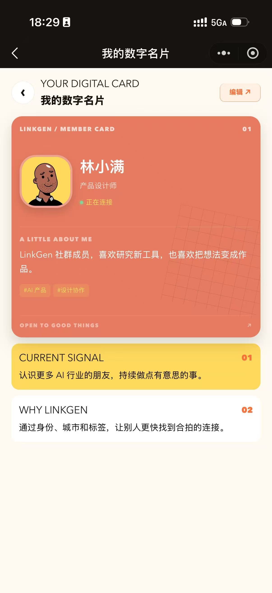
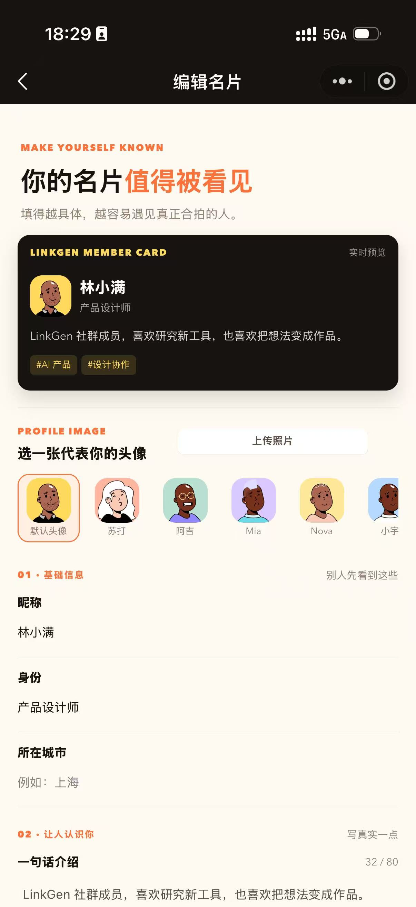

<div align="center">

# LinkGen AI 社群小程序

面向 AI 从业者、独立开发者与创作者的公开社群工具。

围绕「交流、活动、认识彼此」三条主线，提供帖子讨论、活动日历、数字名片与活动采集能力。

[查看变更日志](CHANGELOG.md)

</div>

<table>
  <tr>
    <td><strong>发现</strong><br>浏览讨论，找到值得参与的话题</td>
    <td><strong>活动</strong><br>用日历与时间轴安排下一次见面</td>
    <td><strong>通讯录</strong><br>通过数字名片认识真实的人</td>
  </tr>
</table>

## 这是什么

LinkGen 是一个社群成员日常使用的小程序：可以发帖交流、参加活动、搜索成员，也可以维护自己的数字名片。

当前仓库是可直接导入微信开发者工具运行的版本。页面交互与默认数据已经准备好，数据暂存于本地 Storage，适合产品体验、流程验证与后续接入云开发。学习库前端入口暂缓接入，相关后端方案保留。

## 怎么使用

### 1. 发现：从内容开始交流

1. 打开小程序，默认进入「发现」。
2. 使用顶部搜索或标签筛选，找到感兴趣的帖子。
3. 点击帖子进入详情页，可以点赞、评论、查看作者名片。
4. 点击发布入口，填写标题、正文与标签，发布新的讨论。

### 2. 活动：找到下一场值得参加的活动

1. 进入「活动」，默认查看社区活动。
2. 切换「社区活动 / 精彩活动」，浏览社群内活动或更广泛的公开活动。
3. 使用日期、类型、地点和状态筛选；默认使用时间轴，也可以切换日、周、月视图。
4. 点击活动查看时间、地点、预计人数、报名信息与详情链接。
5. 进入「我的活动」查看已报名活动，以及创建、提交活动。
6. 粘贴公众号、小红书等活动链接，可生成待确认的活动草稿。

活动创建支持：线上分享、线下聚会；线下地点支持饭店、咖啡馆、酒吧、共享办公、展馆、户外空间等，也可以自定义地点。

### 3. 通讯录：用数字名片认识成员

1. 进入「通讯录」，按姓名、身份、城市或标签搜索成员。
2. 点击成员卡片，查看头像、介绍、擅长方向、加入社群目的与标签。
3. 在「我的」中编辑自己的数字名片。
4. 头像可以从默认头像库选择，也可以上传并切换个人头像。
5. 身份与城市分别填写，方便搜索与建立更准确的连接。

### 4. 我的：维护个人信息与参与记录

「我的」集中管理个人名片、我的活动、我的帖子与社群参与数据。编辑名片时可以更新昵称、头像、身份、城市、个人介绍、加入目的与标签。

## 功能地图

| 模块 | 已支持能力 | 适用场景 |
| --- | --- | --- |
| 发现 | 帖子流、标签筛选、关键词搜索、点赞、评论、发帖 | 日常讨论、经验分享、问题求助 |
| 活动 | 社区活动、精彩活动、时间轴、日/周/月视图、筛选、报名 | 找活动、看安排、管理参与记录 |
| 活动创建 | 线上分享、线下聚会、地点推荐、自定义地点、预计人数 | 发起社群活动或提交公开活动 |
| 链接导入 | 活动链接识别、标题与时间地点草稿、人工确认 | 快速收集公众号与小红书活动 |
| Agent 采集 | 候选活动列表、来源、置信度、审核状态 | 定期发现外部活动，交给官方审批 |
| 通讯录 | 成员搜索、标签筛选、数字名片、成员详情 | 找同方向的人，建立联系 |
| 个人中心 | 头像库、头像上传、身份与城市分开、活动与帖子记录 | 维护个人展示与社群参与 |
| 运营审核 | 待审核队列、通过、驳回、官方发布 | 控制公开活动质量 |

## 小程序实际截图

以下均为 LinkGen 小程序运行页面截图，不是设计稿。截图覆盖发现、活动、通讯录、成员名片与个人名片等核心使用路径。

<table>
  <tr>
    <td width="33%" align="center"><br><sub>发现首页：帖子流与社群入口</sub></td>
    <td width="33%" align="center"><br><sub>活动日历：日视图与活动安排</sub></td>
    <td width="33%" align="center"><br><sub>活动日历：时间轴与筛选</sub></td>
  </tr>
  <tr>
    <td align="center"><br><sub>活动详情：报名、日程与发起人</sub></td>
    <td align="center"><br><sub>通讯录：成员搜索与标签</sub></td>
    <td align="center"><br><sub>成员名片：身份、标签与介绍</sub></td>
  </tr>
  <tr>
    <td align="center"><br><sub>我的：个人数据与参与记录</sub></td>
    <td align="center"><br><sub>数字名片：对外展示预览</sub></td>
    <td align="center"><br><sub>编辑名片：头像、身份、城市与标签</sub></td>
  </tr>
</table>

## 关键流程

```text
活动草稿 --(用户提交)--> 待审核 --(官方通过)--> 已发布 --(活动结束)--> 已结束

帖子编辑 --(发布)--> 已发布 --(举报/审核)--> 隐藏

外部链接 --(解析)--> 活动草稿 --(人工确认)--> 待审核
Agent 搜索 --(生成候选)--> 待审核 --(官方通过)--> 已发布
```

## 本地运行

1. 使用微信开发者工具导入本项目目录。
2. 确认 `project.config.json` 中的 AppID；仅体验页面时可使用测试 AppID。
3. 编译运行，默认进入「发现」页。
4. 通过底部导航体验「活动」「通讯录」「我的」三条主流程。

发现、活动、通讯录等页面仍使用本地演示数据；运营管理页已接入 CloudBase 优先的 Agent 候选查询、来源配置、巡查、审批和驳回链路。未部署云函数或未配置管理员时，页面会显示“本地演示数据”，不会把演示候选当作真实采集结果。

活动链接解析仍提供本地草稿兜底；Agent 真实采集需要按 [Agent 部署清单](docs/linkgen-agent-deployment.md) 部署 CloudBase 云函数、配置已授权来源和微信订阅消息。

## 页面结构

```text
pages/feed              发现 / 帖子流
pages/events            活动日历
pages/contacts          通讯录
pages/profile           我的 / 数字名片
pages/post-detail       帖子详情与评论
pages/event-detail      活动详情与报名
pages/member-detail     成员数字名片
pages/create-post       发起讨论
pages/create-event      提交活动
pages/edit-profile      编辑个人名片
pages/admin-review      活动审核与官方发布
```

学习库页面暂不加入 `app.json`，相关云函数和方案文档保留在仓库中，当前版本不作为小程序用户流程的一部分。

## 相关文档

- [功能说明与页面截图](docs/linkgen-feature-overview.md)
- [活动链接导入与 Agent 采集架构](docs/linkgen-ingest-architecture.md)
- [学习库方案与内容承载策略](docs/linkgen-learning-library-plan.md)
- [Agent 与学习库落地方案](docs/linkgen-agent-library-implementation-plan.md)
- [Agent 与 CloudBase 部署清单](docs/linkgen-agent-deployment.md)
- [头像库说明](docs/linkgen-avatar-library.md)
- [公开运营与备案研究](docs/linkgen-compliance-research.md)
- [公开运营准备与执行路线](docs/linkgen-public-operation-plan.md)

## 运营注意事项

公开运营前，需要补齐用户协议、隐私政策、内容审核、举报处理、活动安全提示与后台权限控制。主体、备案和平台能力边界见[公开运营与备案研究](docs/linkgen-compliance-research.md)。
