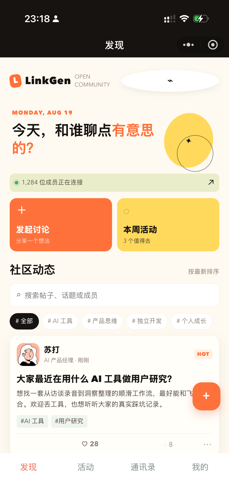
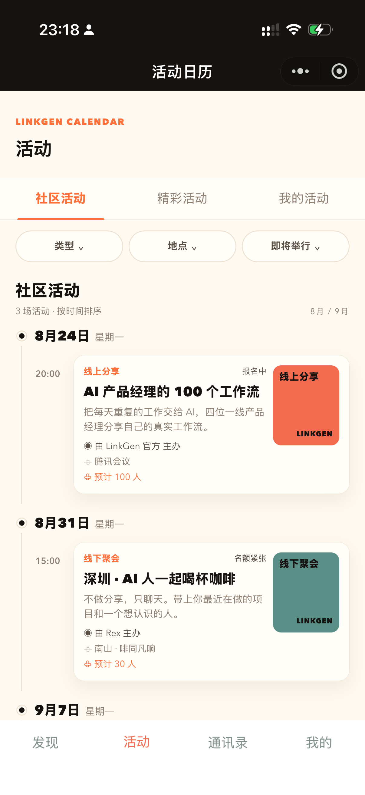
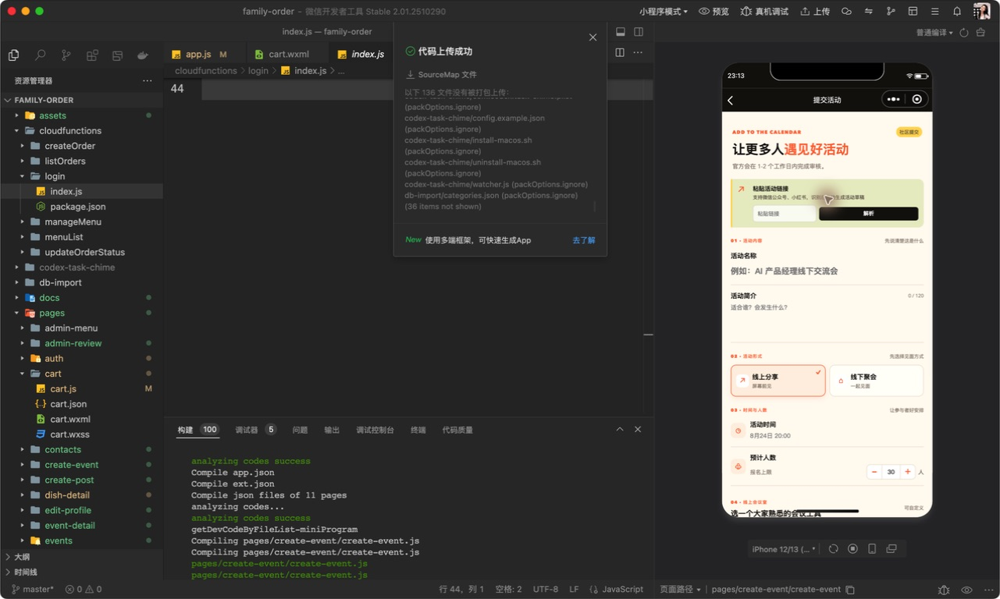
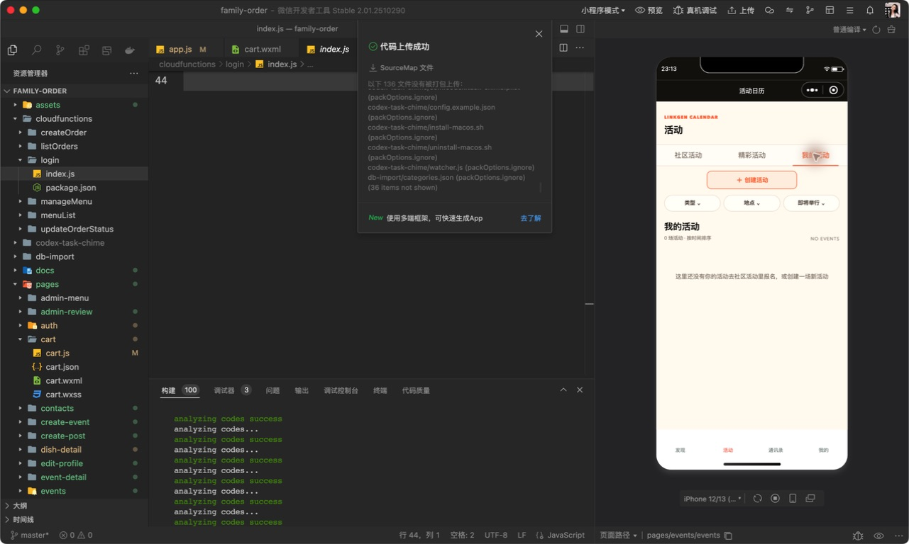

# LinkGen AI 社群小程序

LinkGen 面向 AI 从业者、独立开发者和创作者，提供讨论、活动发现、数字名片和运营审核能力。

## 当前功能

| 模块 | 能力 |
| --- | --- |
| 发现 | 帖子、标签、搜索、点赞、评论、发帖 |
| 活动 | 社区活动 / 精彩活动 / 我的活动，时间轴主视图，日 / 周 / 月视图，类型、地点、状态筛选 |
| 活动导入 | 识别微信公众号、小红书链接，生成可编辑活动草稿 |
| Agent 采集 | 运营端配置公众号/小红书来源，查看分类、质量分、概要和候选活动 |
| 活动审核 | 官方审核、通过发布、驳回，展示来源平台和来源链接 |
| 通讯录 | 成员搜索、标签、数字名片、目的和介绍 |
| 个人中心 | 头像库、头像上传、身份、城市、标签、活动和帖子统计 |
| 学习库 | 暂缓接入小程序；相关云函数、数据种子和方案文档保留，后续再恢复前端入口 |

## 小程序运行截图

以下三张是小程序页面原图，适合作为产品展示截图；图片只保留手机页面，不包含开发者工具外框。

<table>
  <tr>
    <td align="center"><br><sub>发现首页：帖子流与社群入口</sub></td>
    <td align="center"><br><sub>活动日历：筛选与时间轴</sub></td>
    <td align="center"><br><sub>编辑名片：头像、身份与城市</sub></td>
  </tr>
</table>

页面原图尺寸为 `1206 × 2622`，来自微信开发者工具中的小程序实际运行页面。README 提供完整的七张核心页面截图。

### 开发者工具验证记录

以下图片保留完整的微信开发者工具窗口，用于证明对应功能已在模拟器中跑通，不作为产品视觉展示图。图片尺寸为 `1281 × 768`，这是开发者工具窗口尺寸，不是手机模拟器分辨率。

<details>
  <summary>查看活动时间轴、链接导入、我的活动验证图</summary>

  <table>
    <tr>
      <td align="center"><br><sub>活动时间轴</sub></td>
      <td align="center"><br><sub>活动链接导入</sub></td>
      <td align="center"><br><sub>我的活动入口</sub></td>
    </tr>
  </table>
</details>

## 链接导入流程

```text
粘贴公众号/小红书链接
  -> 识别平台
  -> 生成可编辑草稿
  -> 用户核对标题、时间、地点、人数
  -> 提交审核
  -> 官方通过后发布
```

当前仓库是本地数据原型，链接解析使用本地演示草稿。生产环境需要接入服务端解析正文，接口和安全边界见 [活动采集架构](linkgen-ingest-architecture.md)。

学习库前端入口当前暂缓接入，发现页和运营页不展示资料库入口；相关后端能力与方案仅作为后续储备。

## Agent 活动采集

运营端可以配置公众号和小红书重点观察来源。Agent 只负责每日发现和结构化候选活动，不直接发布。运营人员在审核列表中确认：

- 活动是否真实存在
- 时间、地点、报名入口是否有效
- 是否适合 LinkGen 社群
- 来源是否允许转载或聚合

候选同时展示活动图片状态、文章概要、原文链接、来源账号和质量分；通过后写入“精彩活动”，驳回后保留审核记录。运营页已支持 CloudBase 优先查询、手动巡查、来源 URL 配置、管理员审批和驳回；真实定时采集与微信通知仍需要部署云函数、配置来源授权和订阅消息模板，详细方案见 [Agent 监控方案](linkgen-agent-monitoring-plan.md)。

生产环境应使用定时任务调用白名单来源，执行去重、字段置信度判断、失败重试、频率限制和人工审核。

## 本地运行

1. 使用微信开发者工具导入项目目录。
2. 检查 `project.config.json` 中的 AppID。
3. 编译运行，默认进入 `pages/feed/feed`。

项目当前使用本地 Storage 保存帖子、活动和个人资料，适合先验证交互流程。接入云开发时，可以替换 `utils/linkgen-data.js` 的读写实现。
